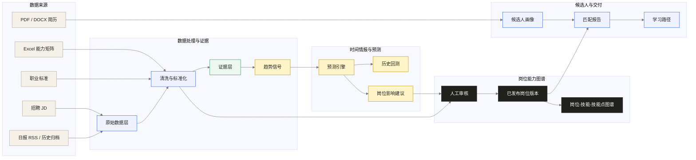
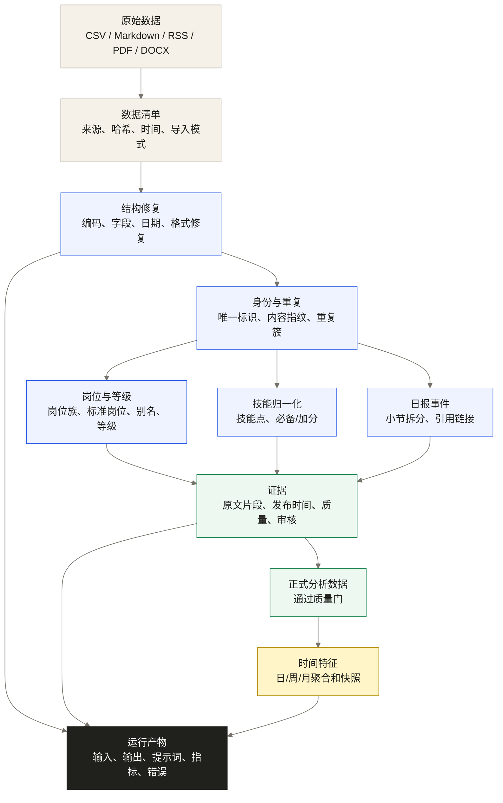
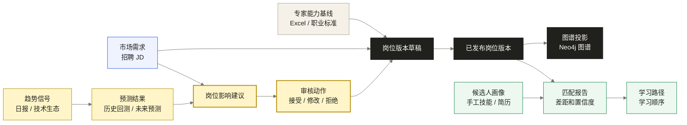

# Hiro2 系统总览

> 这份文档只回答一个问题：Hiro2 的数据如何经过处理，最终形成岗位版本和人岗诊断。
> Mermaid 源码是唯一图源，后续导出的 SVG/PNG 只能放在 `docs/assets/`，不能反向编辑。

## 导出图

- [系统总览 SVG](assets/system-map.svg)
- [数据处理流 SVG](assets/data-flow.svg)
- [岗位决策流 SVG](assets/decision-flow.svg)

## 可信岗位版本是系统中心

赛题要求的岗位发现、岗位更新、图谱和诊断共享一个业务中心，而不是四套功能数据：

```text
多源数据与时间信号 -> 证据/建议 -> 人工审核 -> 已发布岗位版本
                                           -> 图谱 / JD 模板 / 人岗诊断 / 培养任务
```

其中 AI 只负责结构化抽取、多源归因、时间推演和行动解释；`JobImpactSuggestion` 只能进入审核，不能绕过 `JobVersion` 成为正式事实。这个约束使亮点贯穿基础功能，而非成为孤立预测模块。

## 1. 系统总览



### 边界规则

- Excel 和职业标准提供能力本体与专家基线。
- 日报是技术先导信号，JD 是企业需求验证。
- 预测只生成 `JobImpactSuggestion`，不能直接发布岗位版本。
- 人岗匹配只接受 `CandidateProfile + PublishedJobVersion`。
- PostgreSQL 保存事实，Neo4j 保存图谱投影。

## 2. 数据处理流



### 数据层含义

```text
Raw        原始数据，只读，不覆盖
Staged     结构修复，可从 Raw 重建
Normalized 岗位、等级、技能标准化
Curated    通过质量门，可进入业务分析
Feature    时间聚合和模型输入
Run        一次清洗/预测/评测的可复现产物
```

## 3. 岗位决策流



### 发布规则

```text
预测建议 != 岗位事实
岗位草稿 != 正式版本
正式版本必须经过人工审核
匹配只能读取已发布版本
```

## 4. 运行入口

```text
Next.js 前端
  -> FastAPI API / SSE
  -> Application Use Case
  -> Domain Modules
  -> PostgreSQL / Neo4j / Object Storage / LLM Provider

hiro2 CLI
  -> 同一 Application Use Case
  -> data/runs/<run_id>/
```

前端用于业务操作和展示，CLI 用于数据检查、Agent 调试、历史回测、预测复盘和指标导出。两者不能各自实现一套业务逻辑。

## 5. 主要交付路径

```text
新岗位：信号 -> 候选 -> 证据 -> 人工定义 -> 岗位版本
岗位更新：两个时间窗 -> 新增/删除/修改 -> 证据 -> 新版本
人岗诊断：岗位版本 -> 简历/技能 -> 修正 -> 差距 -> 学习路径
历史回测：as_of_date -> 当时快照 -> 未来预测 -> 后验对比 -> 复盘
```
